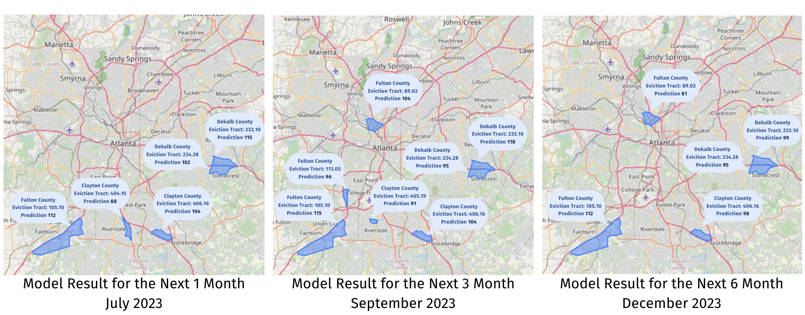
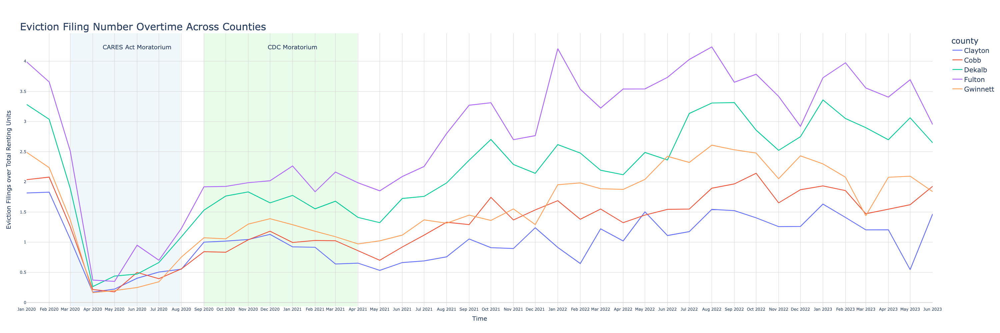
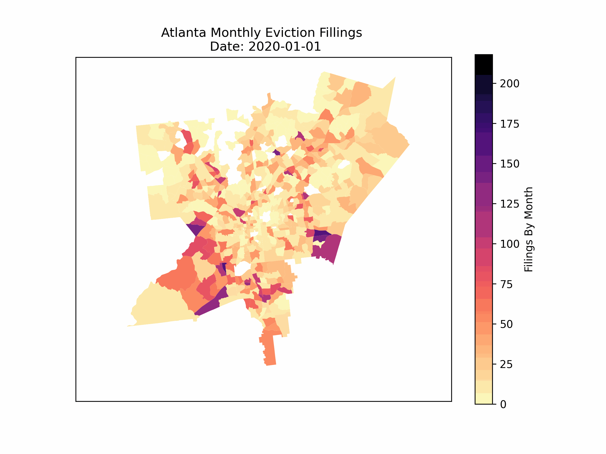
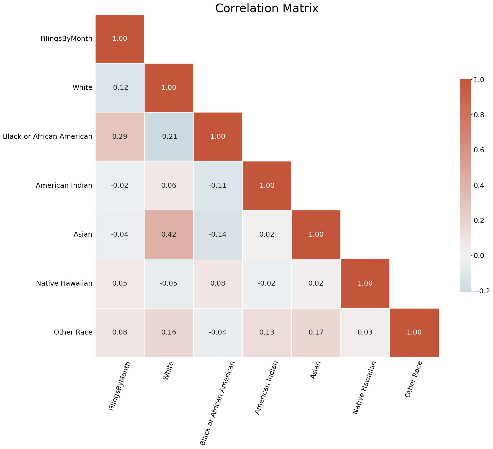
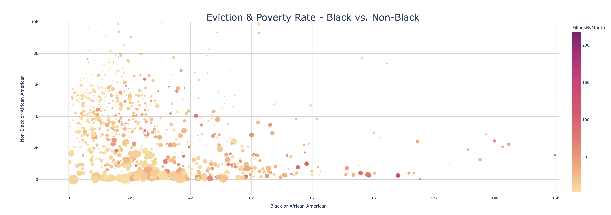
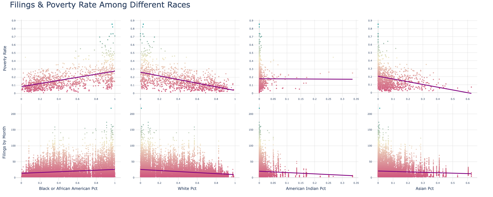
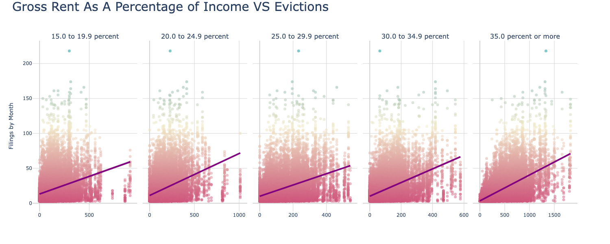
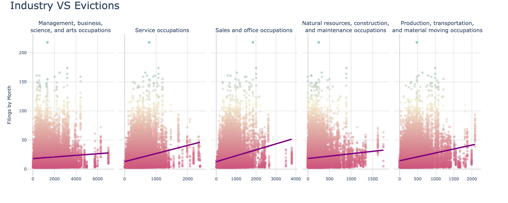

# Predicting Eviction Cases in Atlanta with AI-Driven Forecasting Techniques 
This project is for the 2023 Summer Data Science for Social Good practicum, sponsored by Emory's QTM department, Center for AI and Life, Enterprise Community Solutions, and Accenture. A prediction on eviction court filings in the Metro Atlanta area is conducted, and valuable insights into eviction trends is provided. 

#### -- Project Status: [Completed]

## Project Intro/Objective
Housing instability and eviction are prominent issues that contribute significantly to cycles of poverty, displacement, and socio-economic disparities in communities. The impact of these issues is extensively felt in cities like Atlanta, often leading to widespread consequences that affect community development, health, and overall quality of life.

The Atlanta Eviction Prediction Project is a strategic initiative aimed at addressing these challenges head-on by leveraging predictive analytics and machine learning. We believe that by harnessing the power of data, we can proactively identify potential housing crises, helping communities, policymakers, and social service organizations be better prepared to intervene and prevent evictions.

This project aims to create a model that predicts eviction rates in various neighborhoods throughout Atlanta, using a variety of indicators such as demographic data, economic factors, housing market trends, and other relevant predictors. By anticipating eviction risks and understanding their root causes, we can provide crucial insights and data-driven recommendations to stakeholders, informing them about the areas of greatest need.

This GitHub repository includes all code, data, and resources used in the development and implementation of this predictive model. We also did a final presentation, [the presentation slide](https://www.canva.com/design/DAFo9gra0mI/vHC1FyrOTQf5gSvvtlZepA/edit?utm_content=DAFo9gra0mI&utm_campaign=designshare&utm_medium=link2&utm_source=sharebutton) is available in the link.

### Collaborators
* Audrey Bu <audrey.bu@emory.edu>
* Alina Chen <jiayi.chen@emory.edu>
* Hasong Cho <ha.song.cho@emory.edu>
* Tiantian Meng <tiantian.meng@emory.edu>
* Yiwei Shi <yiwei.shi@emory.edu>

### Methods Used
* Machine Learning
* Data Visualization
* Predictive Modeling
* Time Series Modeling
* etc.

### Technologies
* API for Data Collection
* Excel for Data Preprocessing
* Python for Data Analysis, Modeling, and Visualization
* PowerPoint and GitHub for Project Presentation
* Jupyter Notebook for Reproducible Notebook

## Project Description

### Datasets
1. **Atlanta Region Eviction Tracker (Jan 2020 – May 2023)**: Our project utilizes eviction data collected by the Atlanta Region Eviction Tracker from January 2020 to May 2023. This detailed dataset provides a comprehensive view of eviction cases filed within the Metro Atlanta area, allowing us to analyze patterns and trends. It includes information on eviction filing dates, locations, outcomes, and more. This data is critical for understanding the local housing crisis and aids in predicting future eviction patterns
   
2. **US Census Bureau - American Community Survey 5-Year Data Profile**: We also incorporate data from the American Community Survey (ACS) 5-Year Data Profile provided by the US Census Bureau. This extensive dataset contains a wide array of demographic, social, economic, and housing characteristics. It is vital in our analysis to understand underlying factors influencing evictions, such as income levels, family structure, employment status, and more.

### Variable Inclusion
Based on some literature review of similar eviction prediction projects in other states, we have identified a wide range of potential variables. These include demographic (Race & Sex), economic (Income, education, occupation, etc.), social (Employment), and housing variables, all of which have been shown to be related to eviction in previous studies. 

### Data Cleaning and Handling Missing Values
#### Tract ID Changes: 
During our data cleaning process, we encountered a significant challenge: around 50% of our data was missing. This issue stemmed from the fact that the American Community Survey (ACS) modifies census tracts every ten years, often splitting a single tract into two due to population increases. To tackle this issue, we engaged in a meticulous process of manually comparing maps from different years to identify changes in census tracts (recorded in spreadsheets in datasets folder). This allowed us to fill in gaps in our data and created a more comprehensive dataset. 
#### Missing 2022-2023 ACS Data
We found that the ACS data was only updated until 2021, while our project also required data for 2022 and 2023. As a solution, we used the most recent data from 2021 to replace the missing data for 2022 and 2023. Although not a perfect solution, this strategy allowed us to create a working model with a complete dataset.

### Exploratory Data Analysis: 
After cleaning our data, we conduct an in-depth exploratory analysis. By examining the potential correlations among our selected variables, we are able to identify patterns and relationships that are essential for our modelling phase.

### Model Selection and Feature Engineering: 
We employ XGBoost, a high-performance tree-based model, for our eviction prediction task. The model, enhanced with feature engineering, aids us in determining the most influential features for our eviction prediction task.

### Our Prediction Result

## Exploratory Data Analysis
### Eviction Story: Change in Filing Number Overtime Across Counties

### Is there a racial bias when it comes to eviction?

### Other Potential Variables

## Feature Engineering

1. **Lag Terms**: Add 13 lag terms to include time series information for prediction, you can change the number of lag terms in this model.
   
2. **Binning Method**: Discretize the mean value of historical filing numbers into categorical variable to improve the accuracy of prediction.
   
3. **Add Binary Variables**: Add binary variables based on policies like CARES Act Moratorium and CDC Moratorium.
   
4. **Encoding**: Use one-hot encoding on categorical variables with few categories and label encoding on categorical variables with a lot of categories.

## Model

### XGBoost
* Gradient Boosting Decision Tree Algorithm
* Widely Used in Industries
* Good Interpretability
* Prevent Overfitting through Regularization
* Fast and Efficient with Parallel Processing on Large Datasets
* Handle Missing Values
* Provide Feature Importance

### Multi-step Recursive Time-Series Forecasting
1. **Set Cutoff**: the first month you want to predict
   
2. Train the model using the latest data before cutoff
   
3. Use the prediction results for the next month prediction

4. We provide 1st, 3rd, 6th months prediction currently but you can predict whatever months you want by changing the parameter in the rolling_prediction function at [final_prediction.ipynb](./final_prediction.ipynb)

## Getting Started

Follow these steps to get started with the project:

1. **Clone the Repository**: Clone the repository to your local machine to have access to all the necessary files.

2. **Install Dependencies**: Make sure to install all required packages and libraries.

3. **Data Cleaning**: For the data cleaning process, please refer to [model_pipeline_v5.ipynb](./model_pipeline_v5.ipynb).

4. **Prediction Model**: And for our prediction model, please refer to [final_prediction.ipynb](./final_prediction.ipynb).

5. **ACS Code and Variable Names**: You can find ACS code and their corresponding variable names in [Variable Names for API](./datasets/Variable%20Names%20for%20API.xlsx).

6. **County Tract Changes**: You can find each county's tract changes in the [datasets folder](./datasets).

## Acknowledgement 
This work is sponsored by Emory's QTM department, Center for AI and Life, Enterprise Community Solutions, and Accenture. We would like to thank Dr. Kevin McAlister for his mentorship during the Summer Data Science for Social Good practicum. 

## Contact
* Feel free to contact by email if you have any questions related to this project.
